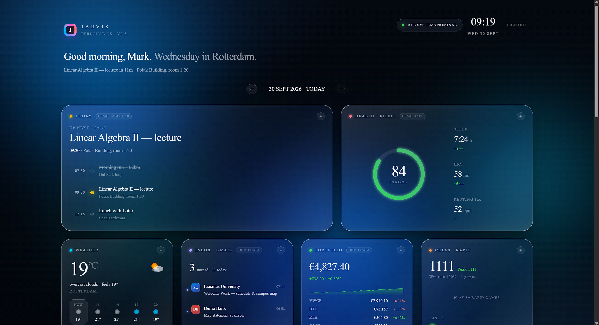
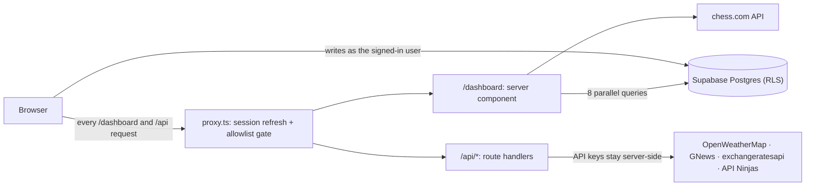

# JARVIS

[](https://github.com/Delta2X-bat/jarvis-dashboard/actions/workflows/ci.yml)

A personal life dashboard: one screen for the things I check and log every day. Training, nutrition, supplements, mood, knee rehab, Dutch vocabulary, weather, news and more sit in a single "liquid glass" grid of cards.

Built with **Next.js 16 (App Router)**, **React 19**, **TypeScript** and **Supabase**, deployed on **Vercel**.

> The live app is private: sign-in is restricted to an allowlist of Google accounts. The screenshot below shows the dashboard.



---

## Why I built this

My daily routine was spread across half a dozen apps: a food tracker, a habit tracker, notes for knee-rehab pain scores, a vocabulary app for learning Dutch before moving to Rotterdam, plus weather and news. I wanted one page that shows all of it at a glance and makes logging a one-tap action.

I also used it to learn a production web stack end to end: auth, a real database with row-level security, server/client rendering boundaries, third-party APIs, security headers and deployment. It's a small app, but it runs in production every day, and most of what I learned came from bugs that only showed up there.

I built it with [Claude Code](https://claude.com/claude-code) as a pair programmer, working from an architecture brief I kept in sync with the code: conventions, past decisions and the reasoning behind them.

## Features

**Daily tracking (persisted in Supabase)**
- **Nutrition**: log meals with calories and macros; daily totals against calorie/protein goals
- **Water**: one-tap glasses with a configurable glass size; edit or delete individual entries
- **Mood and knee pain**: daily check-ins (mood 1–10, knee pain 0–10 with a note) with 7-day trend charts
- **Supplements**: time-windowed checklist (morning / post-workout / dinner / bedtime) that highlights the active window; the list is editable
- **Training**: weekly plan with per-session completion
- **Streaks** and a **13-week activity heatmap** across six trackers, GitHub-style

**Live data**
- Weather forecast and air quality (OpenWeatherMap), headlines (GNews), EUR exchange rates, Bitcoin price (CoinGecko), a daily quote and fact (API Ninjas)
- Chess.com rapid rating, peak, win rate and rating history
- Daily Dutch word with pronunciation via the Web Speech API

**Navigation**
- Browse any past day: a day navigator with a month/year calendar picker, plus `←` / `→` / `T` keyboard shortcuts
- Every card expands into a detail overlay; responsive layout with a mobile jump-nav

## Tech stack

| Layer | Choice |
|---|---|
| Framework | Next.js 16 (App Router, server components, route handlers), React 19 |
| Language | TypeScript (strict) |
| Styling | Tailwind CSS 4 plus a hand-written glassmorphism design system in `app/globals.css` |
| Auth | Supabase Auth, Google OAuth, cookie sessions via `@supabase/ssr` |
| Database | Supabase Postgres with row-level security on every table |
| Testing | Vitest; GitHub Actions runs lint, type-check, tests and build on pushes to `main` and on pull requests |
| Hosting | Vercel (auto-deploy from `main`) |

## Architecture



- **Server-first data loading.** `app/dashboard/page.tsx` authenticates, then loads 91 days of history for every tracker in parallel with `Promise.allSettled`, so one failing source doesn't take the page down. Narrower views (today, the 7-day charts, streaks, the heatmap) are all derived from those same results. This consolidated the load from 16 queries to 8.
- **Client state in one place.** `DashboardClient.tsx` owns state and write handlers; detail views and panels in `components/` are presentational and receive props and callbacks.
- **API routes as thin proxies.** Third-party keys never reach the browser. Each route authenticates, applies a fetch timeout, caches per upstream request (`next: { revalidate }`), and degrades gracefully instead of throwing.

## Engineering highlights

A few problems that were more interesting than they looked:

- **Timezones.** Stamping "today" with `new Date().toISOString()` uses the UTC date, which disagrees with local time between 00:00 and 02:00 in Amsterdam, so late-night logs landed on the wrong day. The fix: one helper, `amsterdamIsoDate()`, is the single source of truth for the current day on both server and client. The date helper and the streak logic both have tests for the midnight boundary in summer and winter time.
- **Hydration.** Anything that depends on the current time is rendered from a static placeholder on the server and filled in after mount, so server and client HTML always match.
- **Render budget.** A per-second countdown at the dashboard root was re-rendering all ~20 cards every second. Per-second state now lives only in small leaf components (`Clock`, the countdown detail), and the root re-renders about three times a minute.
- **Races and optimistic UI.** Water and food updates apply immediately and roll back if the write fails. Browsing past days uses a generation counter so a slow response can't overwrite a newer one, and past days are cached for the session. In-flight guards stop double taps from firing duplicate writes.
- **Security.** Authentication isn't authorization: Google sign-up is open at the provider level, so an email allowlist (paired with a check that the session really came from Google) is enforced in the proxy, the OAuth callback and the landing page. Other layers:
  - CSRF protection with exact-origin matching on state-changing auth routes (the allowlist and origin check are unit-tested against lookalike hosts and prefix matches)
  - A Content Security Policy that limits connections to the app's own origin, Supabase and CoinGecko, blocks framing and plugins, and restricts form targets. `script-src` still allows `'unsafe-inline'` for Next.js's inline hydration scripts, so it is not a nonce-based strict CSP.
  - HSTS, COOP/CORP, `X-Frame-Options: DENY`, `nosniff`, and a Permissions-Policy that disables camera, microphone, geolocation, payment, USB, Bluetooth and autoplay
  - Row-level security on all tables
  - Validation of everything read back from `localStorage`

## Project structure

```
app/
  page.tsx                 Login page (Google OAuth)
  auth/                    login · callback · signout route handlers
  dashboard/
    page.tsx               Server component: auth gate + parallel data load
    DashboardClient.tsx    Client root: state, write handlers, card grid, overlays
    types.ts · helpers.ts  Shared types/constants and pure helpers
  api/                     Server-side proxies for third-party APIs
components/
  details/                 Overlay detail views
  panels/                  Interactive panels (food, supplements, training, Dutch)
  ui/                      Shared primitives and error screen
lib/
  hooks/                   useApiQuery + one hook per external API
  utils/                   Date helpers, streak logic (+ tests), CSRF origin check
  allowedEmails.ts         Sign-in allowlist
  chess.ts                 chess.com client (server-only)
proxy.ts                   Session refresh + auth/allowlist gate
next.config.mjs            Security headers
```

## Running locally

**Prerequisites:** Node.js 20.9+, a free [Supabase](https://supabase.com) project, and free API keys for the services below.

1. **Install**
   ```bash
   git clone https://github.com/Delta2X-bat/jarvis-dashboard.git
   cd jarvis-dashboard
   npm install
   ```

2. **Configure Supabase**
   - Enable the Google provider under *Authentication → Providers*.
   - Add `http://localhost:3000/auth/callback` to the allowed redirect URLs.
   - Create the tables below with RLS enabled and an owner-only policy (`auth.uid() = user_id`). The DDL for the newer tables and the date-keying migrations is in the comment block at the top of [`app/dashboard/page.tsx`](app/dashboard/page.tsx).

   | Table | Purpose |
   |---|---|
   | `mood_logs`, `knee_logs` | One score per day (unique on `user_id, logged_date`) |
   | `water_logs` | One row per glass |
   | `food_logs` / `nutrition_logs` | Individual meals / daily macro totals |
   | `supplement_logs` | Day-complete flag |
   | `training_logs` | Completed sessions per day |
   | `dutch_learned` | Learned vocabulary indices |

3. **Environment variables.** Create `.env.local` in the project root. It is git-ignored; never commit real values.

   | Variable | Required | Purpose |
   |---|---|---|
   | `NEXT_PUBLIC_SUPABASE_URL` | yes | Supabase project URL |
   | `NEXT_PUBLIC_SUPABASE_ANON_KEY` | yes | Supabase anon (public) key |
   | `NEXT_PUBLIC_SITE_URL` | yes | App origin, e.g. `http://localhost:3000` (OAuth redirect + CSRF check) |
   | `ALLOWED_USER_EMAILS` | prod | Comma-separated Google accounts allowed to sign in. |
   | `OPENWEATHER_API_KEY` | for weather | [OpenWeatherMap](https://openweathermap.org/api): weather + air quality |
   | `GNEWS_API_KEY` | for news | [GNews](https://gnews.io) |
   | `EXCHANGE_RATES_API_KEY` | for rates | [exchangeratesapi.io](https://exchangeratesapi.io) |
   | `NINJA_API_KEY` | for quote | [API Ninjas](https://api-ninjas.com) |
   | `CHESS_USER_AGENT` | optional | Identifies the client to the chess.com API |

   A missing API key disables only its card. The route returns `503` and the card shows an unavailable state.

4. **Run**
   ```bash
   npm run dev       # http://localhost:3000
   npm test          # unit tests (Vitest)
   npm run lint      # ESLint
   npm run build     # production build
   ```

## Status and limitations

This is a single-user app built around my own routine, so some things are deliberately personal or not yet connected:

- **Sample data**: the Calendar, Inbox, Portfolio and Health (Fitbit) cards show sample data and are labelled *Demo* in the UI. The Bitcoin row in Portfolio is live.
- **Personal configuration**: the training plan, supplement schedule, Dutch word list, chess username and location (Rotterdam) are constants in the code, not user settings.
- **UV index**: unavailable, because OpenWeatherMap retired the free endpoint that provided it.

Next on the list: real Google Calendar and Fitbit integrations, and a "mark word as learned" flow for the Dutch card. The data for that flow is already loaded but not used yet.
